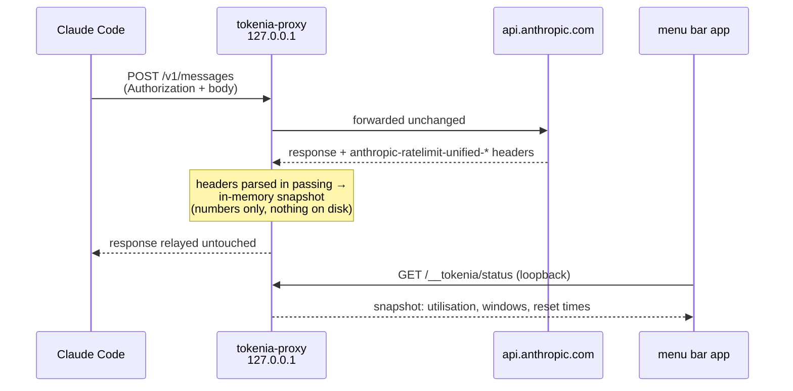
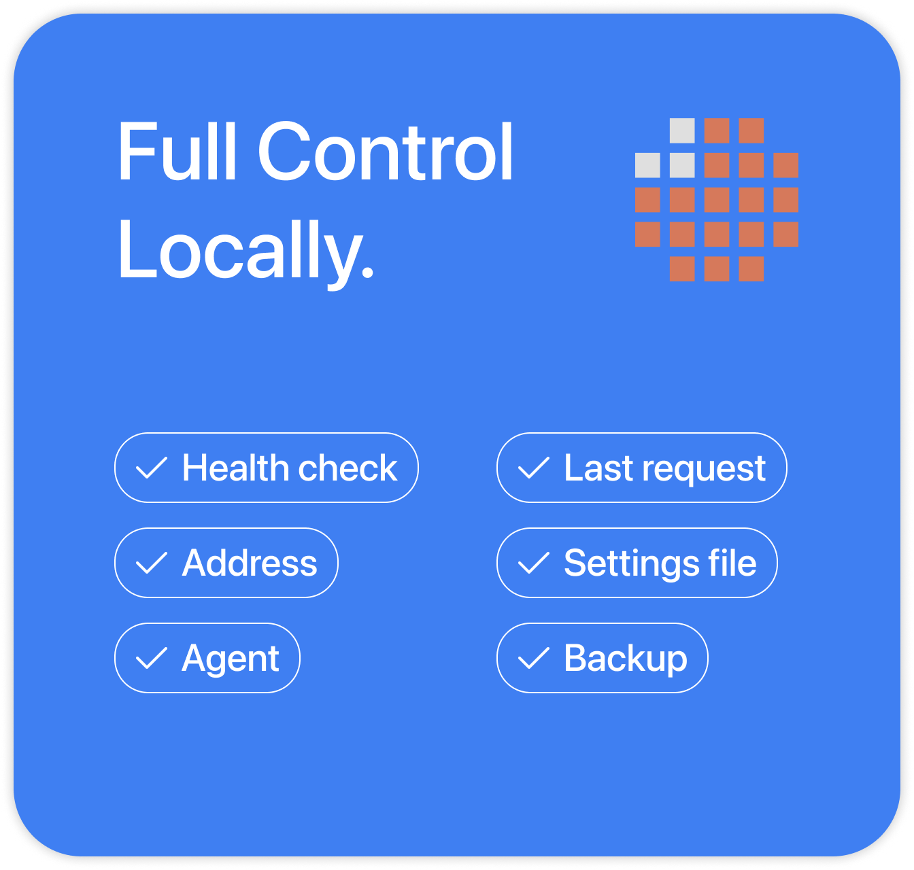

<div align="center">
  

  # tokenia-proxy

  The proxy your OAuth token passes through — in the open.

  [](https://tokenia.dev/download)

  [](https://tokenia.dev)
  [](https://github.com/tokenia-app/tokenia-proxy/actions/workflows/tests.yml)

</div>

The measurement core of [Tokenia](https://tokenia.dev) — a local HTTP proxy
that reads Claude Code usage limits from the rate-limit headers Anthropic
already sends, instead of estimating them from local logs.

This repository is the part of Tokenia that your OAuth token passes through.
It is open so you can read exactly what happens to it.

## How the measurement works

Claude Code is pointed at `127.0.0.1` via `ANTHROPIC_BASE_URL`. The proxy
forwards every request to `api.anthropic.com` unchanged, and on the way back it
parses the `anthropic-ratelimit-unified-*` response headers — the 5-hour and
weekly windows, utilisation, and reset times.



Two endpoints are the proxy's own and are never forwarded: `HEAD /api/hello`
(the installer's health check) and `GET /__tokenia/status` (the snapshot the
widget reads). Everything else passes straight through.

Two properties follow from this design:

- **Passive.** The proxy never issues a request of its own. It only reads
  headers off responses Claude Code was already going to receive.
- **It reports Anthropic's number, not an estimate.** Log-based trackers count
  tokens from local JSONL files; that count diverges from the real limit
  because cache reads inflate it while claude.ai usage never appears in it.
  The headers are the counter Anthropic actually enforces.

## What never happens to your token

<p align="center">
  
</p>

Request and response **bodies are never written to disk or logged**. The
`Authorization` header is **forwarded and forgotten** — it is never logged,
never persisted, never sent anywhere except `api.anthropic.com`. Only parsed
numbers (utilisation, status, reset times) are retained.

This is not a promise in a README. It is pinned by a test:

> `SecurityTests.swift` — *"Driving a request with a live-looking token emits
> no trace of it"*

The suite drives a request through the full proxy path with a token-shaped
credential and secret-shaped body text, then asserts that no log output, no
diagnostic, and no persisted artefact contains either. Any change that would
leak them fails CI.

## Inspectable while it runs

<p align="center">
  
</p>

The proxy answers a local health check and reports its own state — address,
last request seen, the settings file it wrote and the backup it kept — so the
app's diagnostics panel, or plain `curl`, can always answer "is it alive and
what did it change".

## What's here

| Target | What it is |
|---|---|
| `TokeniaProxy` | The proxy: listener, forwarding, routing, health check |
| `TokeniaCore` | Models and the rate-limit header parser |
| `TokeniaTestSupport` | `FakeUpstream` and the probe/port helpers the tests share |
| `tokenia-stress` | Hostile-load harness: slowloris, connection floods, SSE churn |
| `TokeniaProxyTests` | 84 tests, including the security suite above |

```
swift build
swift test          # 84 tests, 15 suites
```

Requires macOS 14+ and Swift 6.

## Relation to the Tokenia app

[Tokenia](https://tokenia.dev) is a paid menu bar widget built on top of this
proxy — gauges for both limit windows, reset countdowns, per-project usage,
and pace warnings. The widget, licensing and UI are closed source; the code
that touches your credentials is this repository.

The app's repository is at
[tokenia-app/tokenia](https://github.com/tokenia-app/tokenia). This repo is a
one-way export of the proxy targets from there: development happens in the
app's tree, and releases sync the proxy sources here. Issues and PRs are
welcome in both places; proxy PRs get applied to the app's tree and flow back
out with the next sync.

## License

MIT — see [LICENSE](LICENSE).
